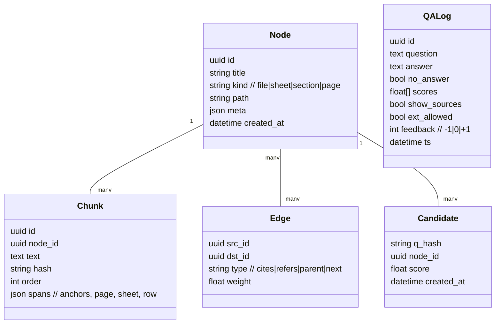

# ARCH-СПРИ v0.1 — Архитектурный документ (MVP R0.1–R0.3)

## 01-Brief

**Цель.** Построить privacy-first систему “WOOF-KNOW (СПРИ)” для локального/гибридного Graph-aware Q&A по пользовательским данным с акцентом на управляемость рисков (strict_local по умолчанию), измеримый KPI и расширяемость через плагины.

**Границы MVP.**

* **R0.1 (CLI ядро):** Markdown-first, локальный LLM (Ollama), базовый retriever, заглушки контуров reranker/verifier, экспорт отчёта релевантности, конфиг `settings.json`.
* **R0.2 (WebUI):** Text-first ingest (`md, txt, docx, pdf (text-layer)`), UI-контроллы рисков (`show_sources`, `allow_external_context`, kill-switch), feedback (`thumbs up/down`), индикаторы `count/threshold`.
* **R0.3:** Табличные данные (`csv, xlsx`), **SQLite** как дефолтный кэш/граф.

**KPI (MVP).** P95 ≤ 7–10 c; Hit-rate@10 ≥ 0.7 (при `show_sources=true`); «нет ответа» ≤ 20%; UX net-positive ≥ +30 п.п.; cosine threshold=0.8 (настраиваемый).

**Артефакты входа.** PRD (СПРИ v0.x), SWAT/Конкуренты, ResearchOps пакет, «Идеальный стек SA». Политики приватности: `strict_local` (по умолчанию), `hybrid`, `cloud_ok`; глобальный **kill-switch** в WebUI.

---

## 02-Assumptions

1. Данные и вычисления по умолчанию исполняются локально; внешние вызовы запрещены при `strict_local` и могут быть полностью заблокированы kill-switch’ом.
2. LLM по умолчанию — **Ollama + `llama3.1:8b`**, `temperature=0.2`, timeout=60 c; 3×retry на timeout/429.
3. Для R0.3 хранилище кэша/графа — **SQLite (WAL ON)**; JSON — обмен/дамп; Parquet — опциональный аналитический экспорт.
4. R0.2 WebUI — только **русский язык**; мультиязычность — после R2+.
5. OCR/ASR/медиа-ingest — **V1.1+**; в MVP только текстовые форматы.
6. Безопасность: TLS≥1.2, OAuth2/OIDC (внутренний режим — токен/локальные пользователи), RBAC, шифрование в покое.

---

## 03-C4

### Context

```mermaid
C4Context
    title WOOF-KNOW (СПРИ) — Контекст
    Person(User, "Пользователь", "Спрашивает и настраивает систему")
    System(Spree, "СПРИ Core", "Graph-aware Q&A локально/гибридно")
    System_Ext(Ollama, "Ollama", "Локальный LLM runtime")
    System_Ext(ExtAPI, "Внешние LLM/API", "Опционально при hybrid/cloud_ok")
    Person_Ext(Admin, "Админ/BA", "Управляет конфигом, сбором метрик")
    User -> Spree: Вопросы/настройки (WebUI/CLI)
    Spree -> Ollama: Промпт/ответ (локально)
    Spree -> ExtAPI: Вызовы (заблокированы при strict_local или kill-switch)
    Admin -> Spree: Конфиг/экспорт метрик
```

### Containers

```mermaid
C4Container
    title СПРИ — Контейнеры
    Container(WebUI, "WebUI (R0.2+)", "Next.js/React", "UI, risk controls, feedback")
    Container(CLI, "CLI (R0.1+)", "Python", "Индексация, Q&A, отчёты")
    Container(Backend, "Core API", "Python FastAPI", "/v1, Orchestrator, Plugins")
    Container(DB, "Cache/Graph DB", "SQLite (WAL)", "nodes/edges/chunks/candidates")
    Container(Store, "Object Store", "FS", "Сырые файлы и дампы")
    Container(LLM, "LLM Runtime", "Ollama", "llama3.1:8b")
    Container(Plugins, "Parser Plugins", "Python", "Ingest адаптеры")
    WebUI -> Backend: JSON/HTTPS
    CLI -> Backend: gRPC/HTTP (локально)
    Backend -> DB: SQL (SQLite)
    Backend -> Store: FS IO
    Backend -> LLM: HTTP local
    Backend -> Plugins: Python ABI
```

### Components (Core API)

```mermaid
C4Component
    title СПРИ — Компоненты Core API
    Component(Conf, "Config Service", "Pydantic", "settings.json, профили privacy")
    Component(Ingest, "Ingest Manager", "Python", "md/txt/docx/pdf→chunks; csv/xlsx (R0.3)")
    Component(Index, "Indexer/Graph", "SQLite", "nodes/edges/chunks; candidates")
    Component(Retr, "Retriever", "Python", "BM25/hybrid; threshold; count")
    Component(Orch, "Orchestrator", "Python", "Prompt build, tooluse, policies")
    Component(Ans, "Answer Synthesizer", "Python", "LLM, citations, no-answer")
    Component(Ver, "Verifier (stub)", "Python", "Контракт; реализация V1+")
    Component(Obs, "Observability", "OpenTelemetry", "metrics/logs/traces")
    Component(Sec, "Security", "OAuth2/OIDC, RBAC", "authN/authZ, rate limit")
    Rel(Conf, Orch, "Загружает профили/лимиты")
    Rel(Ingest, Index, "Пишет индексы/граф")
    Rel(Retr, Index, "Читает кандидатов")
    Rel(Orch, Retr, "Формирует запросы/лимиты")
    Rel(Orch, Ans, "Формирует промпт")
    Rel(Ans, LLM, "Локальный вызов")
    Rel(Orch, Ver, "Опционально")
    Rel(Obs, все, "Теле-метрия")
    Rel(Sec, Backend, "Глобальные политики/killswitch")
```

---

## 04-Data (ER + DDL)

### ER (упрощённо)



### Ключевые DDL-фрагменты

```sql
-- Версионирование схемы
CREATE TABLE IF NOT EXISTS meta(key TEXT PRIMARY KEY, val TEXT);

-- Узлы и связи
CREATE TABLE node(
  id TEXT PRIMARY KEY, title TEXT, kind TEXT, path TEXT,
  meta JSON, created_at TEXT
);
CREATE TABLE edge(
  src_id TEXT, dst_id TEXT, type TEXT, weight REAL,
  PRIMARY KEY(src_id, dst_id, type)
);

-- Фрагменты и кандиды
CREATE TABLE chunk(
  id TEXT PRIMARY KEY, node_id TEXT, text TEXT, hash TEXT, "order" INT,
  spans JSON,
  FOREIGN KEY(node_id) REFERENCES node(id)
);
CREATE INDEX chunk_node_idx ON chunk(node_id);

CREATE TABLE candidate(
  q_hash TEXT, node_id TEXT, score REAL, created_at TEXT,
  PRIMARY KEY(q_hash, node_id)
);
CREATE INDEX candidate_score_idx ON candidate(q_hash, score DESC);

-- Логи Q&A
CREATE TABLE qa_log(
  id TEXT PRIMARY KEY, question TEXT, answer TEXT, no_answer INT,
  scores JSON, show_sources INT, ext_allowed INT, feedback INT, ts TEXT
);
```

---

## 05-APIs (эскиз /v1)

| Method | Path                 | Request (JSON)                                                                                          | Response (JSON)                                                                                                       | Компонент                                                 | Сущности                                                                                                                        |               |       |
| ------ | -------------------- | ------------------------------------------------------------------------------------------------------- | --------------------------------------------------------------------------------------------------------------------- | --------------------------------------------------------- | ------------------------------------------------------------------------------------------------------------------------------- | ------------- | ----- |
| POST   | /v1/ingest           | `{ "paths":[string], "profile":"text                                                                    | table", "limits":{ "max_pages":int, "max_mb":int } }`                                                                 | `{ "ingested":int, "nodes":[uuid], "warnings":[string] }` | Ingest                                                                                                                          | Node, Chunk   |       |
| POST   | /v1/query            | `{ "q":string, "k":int=10, "threshold":float=0.8, "show_sources":bool, "allow_external_context":bool }` | `{ "answer":string, "sources":[{node_id,span}], "count":int, "threshold":float, "no_answer":bool, "latency_ms":int }` | Orchestrator/Answer                                       | Candidate, Node, Chunk                                                                                                          |               |       |
| POST   | /v1/feedback         | `{ "qid":uuid, "value":-1                                                                               | 0                                                                                                                     | 1 }`                                                      | `{ "ok":true }`                                                                                                                 | Observability | QALog |
| GET    | /v1/settings         | —                                                                                                       | `{ "privacy":"strict_local                                                                                            | hybrid                                                    | cloud_ok", "llm":{"provider":"ollama","model":"llama3.1:8b","temperature":0.2,"timeout_s":60}, "limits":{"rate_per_min":100} }` | Config        | —     |
| POST   | /v1/admin/killswitch | `{ "enabled":bool }`                                                                                    | `{ "enabled":bool, "ts":string }`                                                                                     | Security                                                  | —                                                                                                                               |               |       |
| GET    | /v1/health           | —                                                                                                       | `{ "status":"ok","version":"0.1.x" }`                                                                                 | Observability                                             | —                                                                                                                               |               |       |

Правила: OpenAPI 3.1; ошибки — RFC7807; пагинация курсорная, `limit`=50 (max=500); `Idempotency-Key` для небезопасных методов; rate limit 100 req/min.

---

## 06-NFR→Tactics

| NFR                               | Тактики                                                                                                                 |
| --------------------------------- | ----------------------------------------------------------------------------------------------------------------------- |
| Производительность (P95 ≤ 7–10 c) | SQLite WAL; индексы; кэш кандидатов; ограничение `k` и `max_tokens`; преформат промптов; батчинг локальных LLM-вызовов. |
| Надёжность (SLA 99.9%)            | Multi-process supervisor; healthchecks; retry/backoff; ежедневные бэкапы БД; RPO ≤1 ч, RTO ≤4 ч.                        |
| Безопасность/Приватность          | `strict_local` по умолчанию; kill-switch; TLS≥1.2; OAuth2/OIDC; RBAC; at-rest шифрование; журнал без PII (90 дней).     |
| Масштабируемость                  | Горизонталь по процессам API/ingest; sharding по рабочим каталогам; вынесение LLM на отдельный локальный узел.          |
| Наблюдаемость                     | OpenTelemetry метрики/трейсы; event-лог Q&A; KPI-дашборд (P95, hit@10, no-answer%, net-positive).                       |
| Стоимость                         | Локальный LLM; SQLite; гибрид/облако — опционально с бюджетными лимитами.                                               |
| ДР                                | Резервные копии DB+FS; quarterly restore test; “expand–migrate–contract” миграции.                                      |
| i18n/a11y                         | **RU-only** UI до R2; WCAG 2.1 AA; позже — i18n стратегия.                                                              |

---

## 07-Варианты

### A) Local-only (дефолт MVP)

**Плюсы:** приватность, низкая стоимость, простая ops.
**Минусы:** ограниченная мощность модели; нет внешних тулов.
**Риски:** PDF-краевые кейсы.
**TCO:** S; **Скорость:** fast.

### B) Hybrid (opt-in)

**Плюсы:** лучшее качество/скорость на сложных вопросах.
**Минусы:** риски утечки; требуется строгая конфигурация.
**TCO:** M; **Скорость:** mid.

### C) Cloud-centric (post-MVP)

**Плюсы:** масштаб и модели SOTA.
**Минусы:** стоимость, приватность, комплаенс.
**TCO:** L; **Скорость:** mid.

---

## 08-Сравнение

| Критерий                         | Local-only |  Hybrid | Cloud-centric |
| -------------------------------- | ---------: | ------: | ------------: |
| KPI достижимость (MVP)           |    **5/5** |     4/5 |           3/5 |
| Приватность                      |    **5/5** |     3/5 |           2/5 |
| Стоимость (TCO)                  |    **5/5** |     3/5 |           2/5 |
| Качество ответов (сложные кейсы) |        3/5 | **4/5** |       **5/5** |
| Риски интеграции                 |    **5/5** |     3/5 |           2/5 |
| Операционная простота            |    **5/5** |     3/5 |           2/5 |

**Вывод:** для MVP — **Local-only**. Hybrid — как `opt-in` режим с kill-switch.

---

## 09-Recommended Architecture

Вариант **A (Local-only)** как базовая поставка; режимы `hybrid/cloud_ok` — опциональные профили с явной индикацией в WebUI и глобальным kill-switch.

Границы: локальные/периметровые установки, чувствительные данные, офлайн. Для масштабных/англоязычных доменов — рассмотреть Hybrid.

---

## 10-ADR (MADR)

**ADR-001 — DB кэша = SQLite (WAL)** — *Accepted*
Context: локальная установка, простые бэкапы, p95 цели.
Decision: SQLite + WAL, индексы; JSON — экспорт; Parquet — аналитика.
Consequences: просто в ops; миграции versioned.

**ADR-002 — LLM runtime = Ollama `llama3.1:8b`** — *Accepted*
Decision: локально, T=0.2, timeout=60 c, retries.
Consequences: контроль стоимости/приватности; качество зависит от домена.

**ADR-003 — Privacy default = `strict_local` + kill-switch** — *Accepted*
Decision: UI-контроллы, запрет внешних вызовов по умолчанию.
Consequences: безопасно для MVP; гибкость через профили.

**ADR-004 — Архитектурный контракт плагинов** — *Accepted*
Decision: стабилен **ParserPlugin**; Retriever/Reranker/Verifier — интерфейсы, реализация после MVP.

---

## 11-Риски и меры

| Риск                                  | НФР/Компонент   | Митигирующие меры                                                             |
| ------------------------------------- | --------------- | ----------------------------------------------------------------------------- |
| Падение качества на сложных PDF       | Ingest/Answer   | Двойной парсер (PyMuPDF/pdfminer), эвристики чанкинга, fallback «нет ответа». |
| Перф. регрессия при больших каталогах | Index/Retriever | Инкрементальная индексация, лимиты размера/страниц, профили `k`, индексы БД.  |
| Неправильная конфигурация приватности | Security/WebUI  | Явные бейджи режима, kill-switch, e2e-тесты политик.                          |
| Коррупция БД/FS                       | DB/Ops          | WAL, ежедневные бэкапы, restore-тесты поквартально.                           |
| Невыполнение KPI                      | Observability   | Дашборд KPI, A/B промптов, пайплайн офлайн-оценки.                            |

---

## 12-Roadmap

* **R0.1 (CLI, 2–3 недели):** ingest md/txt; локальный Q&A; отчёты; конфиг; логи/KPI; офлайн-набор Q&A — freeze **T0+10**.
* **R0.2 (WebUI, +3–4 недели):** Text-first ingest; UI-контроллы; feedback; health; read-only settings.
* **R0.3 (+2 недели):** CSV/XLSX ingest; SQLite DB; экспорты; оптимизации производительности.
* **V1.1+:** OCR/ASR; Verifier/Reranker; мультиязычность; облачные интеграции.

**Acceptance (MVP):** KPI достигнуты; DoD R0.2 включает кейсы «многоформатный каталог», «лимиты размера/страниц».

---

## 13-Open Questions

1. Нужен ли admin-UI (OIDC) уже в R0.2 или оставить токен-based?
2. Формат якорей источников — достаточно ли `spans` JSON?
3. Добавлять `spree dump --parquet` уже в R0.3?

---

## 14-Дополнения к PRD/BRD/NFR

* **Язык UI:** Только **русский** для MVP. Мультиязычность — после R2.
* **Политики приватности:** `strict_local` по умолчанию; `hybrid/cloud_ok` — в настройках; глобальный **kill-switch** в WebUI.
* **KPI:** как в Brief; порог cosine по умолчанию 0.8 (настраиваемый).

---

## 15-RTM (трассируемость)

| Требование             | Компонент/API                   | ER              | NFR          |
| ---------------------- | ------------------------------- | --------------- | ------------ |
| Text-first ingest      | Ingest `/v1/ingest`             | Node/Chunk      | Perf         |
| Ответ с источниками    | Orchestrator/Answer `/v1/query` | Chunk/Candidate | Perf, Observ |
| «Нет ответа» корректен | Answer                          | QALog           | Accuracy     |
| Контроль приватности   | Security `/v1/admin/killswitch` | —               | Security     |
| KPI-сбор               | Observability `/v1/feedback`    | QALog           | Observ       |
| CSV/XLSX               | Ingest                          | Node/Chunk      | Perf         |

---

## 16-Security Model (STRIDE)

* **S/T (spoofing/tampering):** Подмена настроек → подпись/контроль целостности `settings.json`, RBAC Admin.
* **R (repudiation):** Аудит действий; неизменяемые логи.
* **I (information disclosure):** `strict_local`, kill-switch, шифрование диска.
* **D (DoS):** rate-limit 100 req/min, backoff.
* **E (elevation):** OIDC/OAuth2, токены с TTL, аудит.
* **Логи/Аудит:** без PII; retention 90 дней; доступ — только Admin.

---

## 17-Compliance & Privacy

* **Классы данных:** Текстовые/табличные файлы; чувствительные данные возможны → **strict_local** по умолчанию.
* **GDPR/CCPA (базово):** DSAR — удаление файлов/индекса; минимизация логов; экспорт собственных данных.
* **Retention:** файлы/индексы — пока пользователь хранит; логи — 90 дней.

---

## 18-Ops Plan

* **SLO/SLI:** P95 latency, no-answer%, hit@10, error rate, CPU/RAM LLM.
* **Мониторинг:** OpenTelemetry → локальный агент/дашборд.
* **Алармы:** P95>10с; error>2%; RAM>90%; диск<10%.
* **DR:** Ежедневный `VACUUM INTO` снапшот; RPO≤1ч, RTO≤4ч; квартальные restore-учения.
* **Runbooks:** «LLM не отвечает», «DB locked», «kill-switch активирован».

---

## 19-API Governance

* Версионирование: `/v1`; OpenAPI 3.1; **RFC7807** ошибки.
* Пагинация: курсорная (`limit`=50, max=500).
* Idempotency: заголовок `Idempotency-Key` для небезопасных методов.
* Rate limit: 100 req/min (429 + `Retry-After`).
* Таймзона: UTC; форматы ISO-8601; UUIDv7.

---

## 20-Cost Model (FinOps)

* **Драйверы:** CPU/RAM для LLM; IO SQLite; диски для индексов/дампов.
* **TCO/нода (локальная):** переменные издержки ≈ 0; CapEx — машина пользователя.
* **Оптимизации:** (1) Квантизация модели (Q4_K_M); (2) Ограничение `k` и `max_tokens`; (3) Инкрементальная индексация; (4) Кэш кандидатов.

---

## 21-Evaluation Report (план)

* **Набор:** 20–50 Q→A, freeze **T0+10**; owner: Researcher; accountable: BA.
* **Метрики:** hit@10, no-answer%, P95, net-positive.
* **Fail-cases:** длинные pdf-страницы; таблицы до R0.3; неоднозначные вопросы.

---

## 22-ML Architecture (если применимо)

* **Serve:** локально через Ollama; prompt-templates версионируем.
* **Drift:** отслеживание метрик качества; review промптов.
* **Lineage:** версия модели/темплейта в `qa_log`.

---

## 23-Licensing & SBOM

* **Зависимости:** Python 3.11+, FastAPI, Pydantic, PyMuPDF/pdfminer.six, python-docx, pandas/openpyxl, sqlite3, OpenTelemetry.
* **SBOM:** CycloneDX в CI; проверка лицензий.

---

## 24-Deliverables

* `ARCH-СПРИ.md` (этот документ, v0.1, UUIDv7).
* `openapi.yaml` (3.1), lint (Spectral ruleset).
* `ddl.sql` (минимальный сэмпл).
* `settings.schema.json` (Pydantic → JSON Schema).
* Диаграммы (Mermaid) в репозитории; стабильные ID.

---

### TRI-CHECK — отчёт

* **syntax_errors:** []
* **consistency_gaps:** []
* **stress_findings:** []
* **governance_issues:** []
